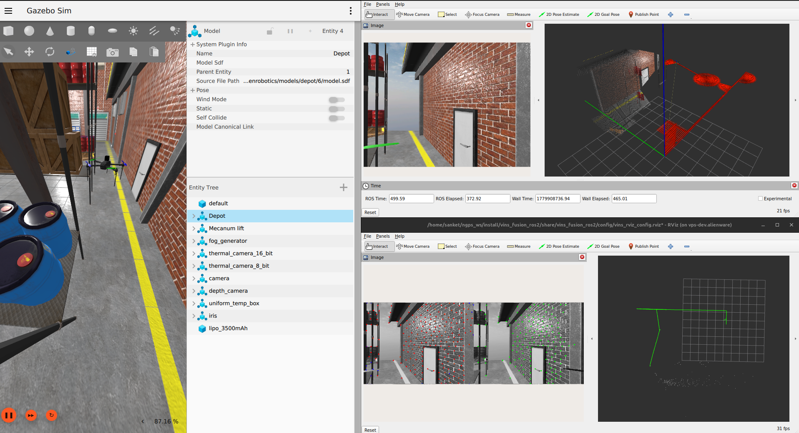
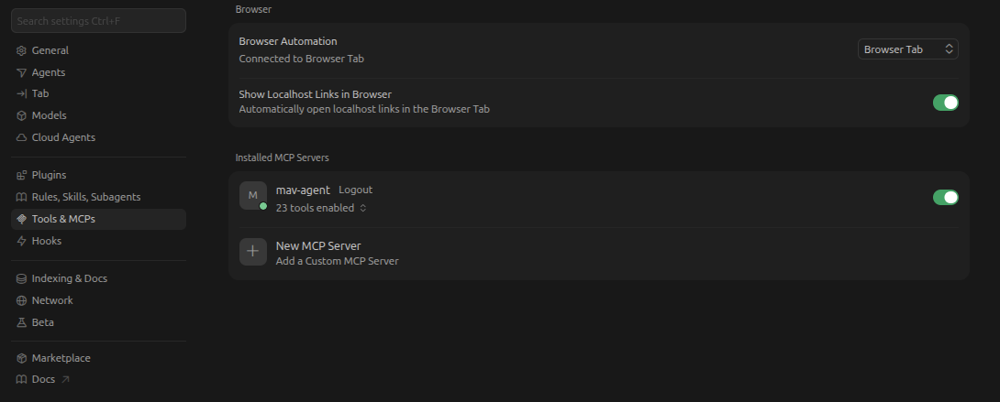
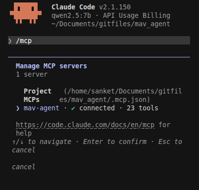

# mav-agent

Agentic control for ArduPilot / MAVLink vehicles

## Demos

- [LangGraph agent TUI](https://youtu.be/3irVZASZwN8) - natural-language control via `mav-cli` (arm, takeoff, move, etc.)
- [Cursor agent over MCP](https://youtu.be/L-Ah2H9a5AQ) - external agent connected to the MCP server, visual follow / servoing

## Setup

```bash
pip install -e .
```

### Qwen-VL (detection / follow (visual servoing) / inferencing)

- **Local (default):** run an OpenAI-compatible Qwen server ([vLLM setup](#vllm-setup)); point `--qwen-base-url` at it (default `http://127.0.0.1:8000/v1`)
- **Remote:** `export ALIBABA_API_KEY=...` and `--qwen-api remote` (Alibaba API)

### vLLM setup (only for local Qwen-VL inferencing)

NVIDIA vLLM Docker image for local Qwen-VL (default model: `nvidia/Qwen2.5-VL-7B-Instruct-NVFP4` in `defaults.py`). Requires NVIDIA GPU and Docker with GPU support.

```bash
export LATEST_VLLM_VERSION=26.04-py3
export HF_MODEL_HANDLE=nvidia/Qwen2.5-VL-7B-Instruct-NVFP4
docker pull nvcr.io/nvidia/vllm:${LATEST_VLLM_VERSION}

docker run -it --gpus all -p 8000:8000 nvcr.io/nvidia/vllm:${LATEST_VLLM_VERSION} vllm serve ${HF_MODEL_HANDLE}
```

### Run mav-cli

```bash
# LangGraph agent TUI (default)
export OPENAI_API_KEY=sk-...
mav-cli --connection udp:0.0.0.0:14550

# Local Qwen-VL (after vLLM server is up)
mav-cli --qwen-base-url http://127.0.0.1:8000/v1 --qwen-api local --connection udp:0.0.0.0:14550

# Remote Qwen-VL (Alibaba)
export ALIBABA_API_KEY=...
mav-cli --qwen-api remote --connection udp:0.0.0.0:14550

# MCP HTTP server (external agents)
mav-cli --mcp --connection udp:0.0.0.0:14550
```

Default MCP server: `127.0.0.1:8765`. POST **`/mcp`**, GET **`/health`**.

Start the MCP server before connecting client  and to setup client, see [MCP client setup](#mcp-client-setup) below.

## Video

### Gazebo camera (UDP 5600)

ArduPilot Gazebo sends **RTP/H264 on UDP 5600**:

```bash
mav-cli --connection udp:0.0.0.0:14550 --image-source udp --video-port 5600
```


### RTSP

```bash
mav-cli --connection udp:0.0.0.0:14550 --image-source rtsp --rtsp 'rtsp://127.0.0.1:8554/stream'
```

## Backends

**MAVLink** (default):

```bash
mav-cli --backend mavlink --connection udp:0.0.0.0:14550
```

**ROS 2** (ArduPilot DDS) - **Only Stub, yet to be completed**:

```bash
source /opt/ros/humble/setup.bash
source ~/ros2_ws/install/setup.bash   # ardupilot_msgs
pip install -e ".[ros]"
mav-cli --backend ros2 --ros-image-topic /camera/image
```

Skills are the same for both backends as of now.

### ROS 2 + Gazebo stack (setup)

- **[ROS 2 with Gazebo (ArduPilot)](https://ardupilot.org/dev/docs/ros2-gazebo.html)** - install Gazebo Harmonic, `ardupilot_gz`, SITL, etc.
- Once setup is done, switch the `ardupilot_gz` repo to the **[`dev/vins` branch](https://github.com/snktshrma/ardupilot_gz/tree/dev/vins)** - iris stereo cameras and bridge topics for VINS (`/camera/image`, `/camera1/image`).

### Vision-based state estimation (VINS)

Run visual odometry **alongside** the ROS 2 sim stack:

- **[vins_fusion_ros2](https://github.com/snktshrma/vins_fusion_ros2)** - ROS 2 port of VINS-Fusion (stereo / mono, IMU). Gazebo configs under `config/gazebo/`.
- Outputs: `/odometry` (VINS world frame), `/odometry_enu` (Z-up corrected for ENU-style frames).



Typical workflow:

```bash
# 1. AP + ROS2 + Gazebo + iris stereo
ros2 launch ardupilot_gz_bringup iris_warehouse.launch.py

# 2. VINS
colcon build --packages-select vins_fusion_ros2
source install/setup.bash
ros2 launch vins_fusion_ros2 vins_fusion_ros2.launch.py use_sim_time:=true

# 3. RViz
ros2 run rviz2 rviz2 -d $(ros2 pkg prefix vins_fusion_ros2)/share/vins_fusion_ros2/config/vins_rviz_config.rviz --ros-args -p use_sim_time:=true
```

See the fork README for full Gazebo + stereo notes.

## MCP client setup

Start mav-agent first:

```bash
mav-cli --mcp --connection udp:0.0.0.0:14550 --image-source udp --video-port 5600
```

Server URL: **`http://127.0.0.1:8765/mcp`**. Check **`http://127.0.0.1:8765/health`**.

Sample configs:

| Client | Config |
|--------|--------|
| Cursor | [`.cursor/mcp.json`](.cursor/mcp.json) |
| Claude Code | [`.mcp.json`](.mcp.json) |

### Cursor as client

1. Start the MCP server (command above).
2. Use project config [`.cursor/mcp.json`](.cursor/mcp.json) or copy it to **`~/.cursor/mcp.json`** for global use.
3. Restart Cursor or reload MCP (Settings → Tools & MCP).



See [Cursor MCP docs](https://cursor.com/docs/mcp).

### Claude Code

1. Start the MCP server.
2. Open the repo root; Claude Code loads [`.mcp.json`](.mcp.json) automatically for project scope.
3. Run `/mcp` to verify the connection.



See [Claude Code MCP docs](https://code.claude.com/docs/en/mcp).

### Other MCP clients

OpenClaw, Nemoclaw, Claude Desktop, and other agents with **HTTP / streamable HTTP MCP** support can connect the same way: point the client at **`http://127.0.0.1:8765/mcp`**.

Use each product's MCP setup guide (transport type, config file location).

Binding **`0.0.0.0`** (`--mcp-host 0.0.0.0`) exposes remote control LAN; default is loopback only.

## Environment variables

Only API keys use env vars. Everything else is CLI flags or code defaults.

| Variable | Purpose |
|----------|---------|
| `OPENAI_API_KEY` | Required for agent TUI (LangGraph) |
| `ALIBABA_API_KEY` | Required when `--qwen-api remote` (Alibaba DashScope) |

## CLI defaults

| Flag | Default |
|------|---------|
| `--connection` | `udp:0.0.0.0:14550` |
| `--backend` | `mavlink` |
| `--image-source` | `udp` |
| `--video-port` | `5600` |
| `--ros-image-topic` | `/camera/image_raw` (ros2 backend) |
| `--qwen-api` | `local` |
| `--qwen-base-url` | see `defaults.py` |
| `--mcp-host` / `--mcp-port` | `127.0.0.1` / `8765` |

## Notes

#### Humanly request :)
The **TUI** interface and **ruff** setup are fully developed by my AI coding agent, so bugs in those areas or errors in those may need a little extra care :)

Originally integrated for DimOS in [PR #1576](https://github.com/dimensionalOS/dimos/pull/1576). Renamed from `follow-anything` to **mav-agent** as scope expanded beyond visual follow.
